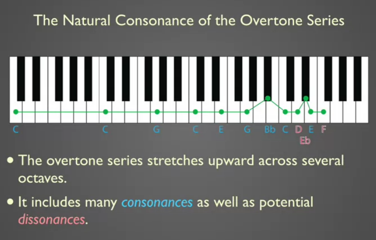

# Introduction to Classical Music

## Week 1

### 1.4 How do We Hear Music? Sound Waves

A=110 Hz

A=220 Hz

A=440 Hz

A=880 Hz

### 1.5: Music Thrills Us, Music Chills Us

Scientists have shown that music affects us physiologically.

### 1.6: Why We Like What We Like? It's Nurture

It has been shown that music helps babies by lowering their heart rates and other stuff.

### 1.7: It's Nurture: The Syntax of Western Music

**Leading Tone**: Pulls toward the Home Pitch or Tonic

**Large Leap**: A Large Leap is reversed by the following pitch

**Harmony**: The Harmony *must* fit with the Melody

**Chord Progression**: The Harmonies usually return hame to tonic

A recent publication shows a spike in brain activity when a certain note is played.

### 1.8: Why We Like What We Like? It's Nature

There are universal principles of physics with music.

We have the **fundamental** and **overtones**:

"Also sprach Zarathustra" by Strauss, 1896 (opening of 2001: A Space Odyssey)

- the hero at first, can't get it 
- tries once again, and is able to achieve it and hold it

