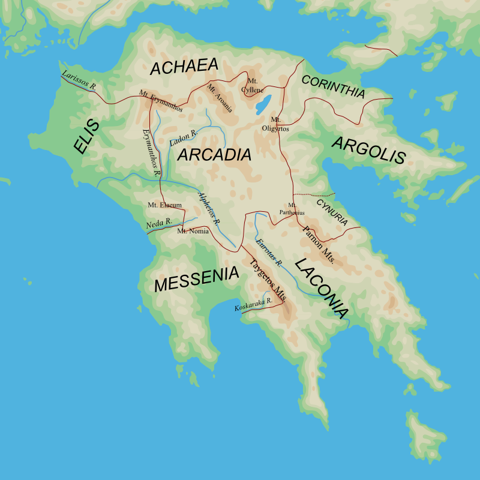

# Week 3

## Week 3 / Lecture 1: Sparta - Conquest

Moving to the southern Greece to the Peloponnese to one of the most important polis of the day: **Sparta**

Sparta comes with a warning label: it was unique

- Sparta was located roughly where Arcadia and Laconia meet

The way it defined itself was very different.

Sparta was not totally separated from the rest of the Greek world.

The aspect of equality was more honored in the breech rather than the observance of equality.

Tyrtareus, a poet, spokesman for a kind of Spartan value.

- like Homer, Tyrtereus, was applied to a number of different poems that were attributed to one

Originally, Sparta was four straggling unwalled villages: "Our men are our walls."

- took advantage of their location, which is on the Eurotas River, a swift flowing cold stream that begins in the mountains of Arcadia and flows down to the sea.
  - Sparta had access to clean water
- also, Sparta located between two mountain ranges
  - a beautifully defensible location
  - controlled access to the entire region in the Southern Peloponnese

- in Homer, Sparta is the home of Menelaus and Helen
- in the Trojan war, the Spartans contribute a large contingent, but by no means the largest
  - part of the generalized Achaean community
- Sparta in the Dark Ages and in the early Archaic Age was really no different from the other Greek communities of the time.

- Sparta's remains are fairly meager:
  
  - Thucydides, the historian said, that if people found the ruins of Athens, they would think that the Athenians were much more powerful than they actually had been and Spartans much less powerful than they actually were.
  
- where things start to change is in the eighth century with the so called First Messenian War (740-720 BCE)

- these dates are very approximate

- First Messenian War CA. 740-720 BCE

- foundation of Taras CA. 710

- Defeat of Spartan invading force by argives at Hysiae CA. 670

- Second Messenian War CA. 670-650 (?)

  - Tyrtaeus 11 ...Feel no fear before the multitude of men, do not run in panic,

    But let each man bear his shield straight toward the fore-fighters,

    Regarding his own life as hateful and holding the dark

    Spirits of death as dear as the radiance of the sun.

    ...Those who dare to remain in place at one another's die

    And advance together toward hand-to-hand combat and the

    Fore-fighters,

    They die in lesser numbers, and they save the army behind them;

    But when men flee in terror, all soldierly excellence is lost.

    (Translated by Andrew M. Miller, *Greek Lyric* [Hackett: 1996])

- Spartans ended up winning and took over the western land of Messenia, a massive agriculture area

  - a historic 3,000 square miles, the Spartan polis, 3 times as big as Attaca, that is the territory of the Athenian polis

- Spartans also acquired a subject population, the Messenians

  - became state-owned serfs, called Helots

- Spartans had to control the Helots who outnumbered them

- they developed an extremely rigid militarily based system of life, society, education, the whole thing, to respond to this.

- at this time, almost certainly, Sparta underwent a change that separated itself from other archaic Polis

- that turned it into the Sparta of Spartan legend that gives us the adjectives, in English, of Spartan, meaning spare or bare, austere, or laconic, this area is called Laconia, and laconic is short speech, because the Spartans came to be famoused for speaking in clipped, little sentences: just the facts, just what you needed to do.

- Lycurgus, stood over this entire development, a shadowy figure, his name etimologized as something like wolf-worker

  - we will never know if he actually existed
  - the reforms of Sparta could not have been done by just one man
  - nonetheless, he became the founding hero of the spartan system
  - his name is attached to the reforms