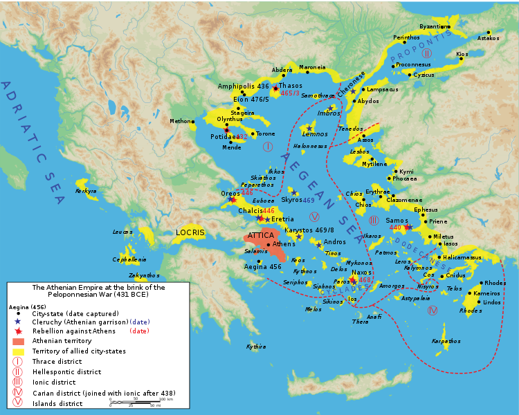

# Week 5

## Week 5 / Lecture 1: The Aftermath of the Persian Wars - The Delian League

- we have seen how the Greek states came together to defeat the Persians
- 3 main outcomes of the war:
  - Persians were utterly defeated
  - there was a sense of Greek unity, briefly
    - a monument still stands in Istanbul, Turkey, on it, it says:
      "These fought the war: the Lacedaimonians. The Athenians. The Corinthians. The Tegeans. The Sicyonians. The Aeginetans...(and 25 more Poleis)"
- Greeks called any non-Greeks barbarians
  - main factor was that they didn't speak Greek
- Athens and Sparta come out as the two hegemonic, dominant polis in this group
- two heroes of the Persian Wars: Pausanias and Themistocles
- both had a checkered past
- Themistocles, an Athenian:
  - Sparta proposed not rebuilding the wall around north of the Pelopennese
  - Athens was not too excited about that
  - Themistocles stalled the Spartans while they completed the wall
  - **he had enormous power and prestige**
    - this caused political antagonism
  - his political enemies finally did get him ostracized in 471-470, 9 years after his victories in the Persian War
  - then, he went to Persia to be a Greek advisor
- **So many of the leaders suffered similar fates**
- so on Delos, Apollo and Artemis reigned. It is sacred because myth says Leto gave birth to them here.
- a league was formed that would meet at Delos, due to its sacred nature
  - each of the states, member states, was guaranteed autonomy
  - annual contribution could be money or ships
  - they had in effect established for themselves the mechanism, or the prelude to Athenian domination
- no longer was this the old war of Hoplites, those middling men, those citizen soldiers, who provided themselves their own armor. Instead, now we have warfare, year-round.
  - the Navy was kept on constant patrol
    - to keep Persians away
    - to collect contributions, whcih came to be called tribute
    - the Athenian sailors received state pay
    - **economically, the Navy is very costly**. It requires constant cash flow.

## Week 5 / Lecture 2: From Delian League to Athenian Empire

